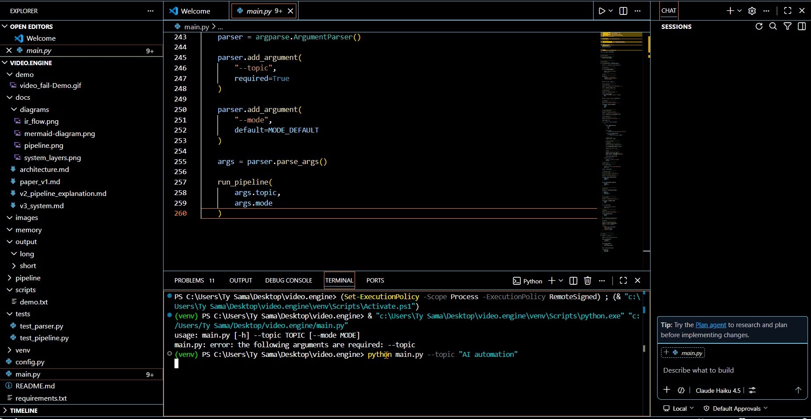
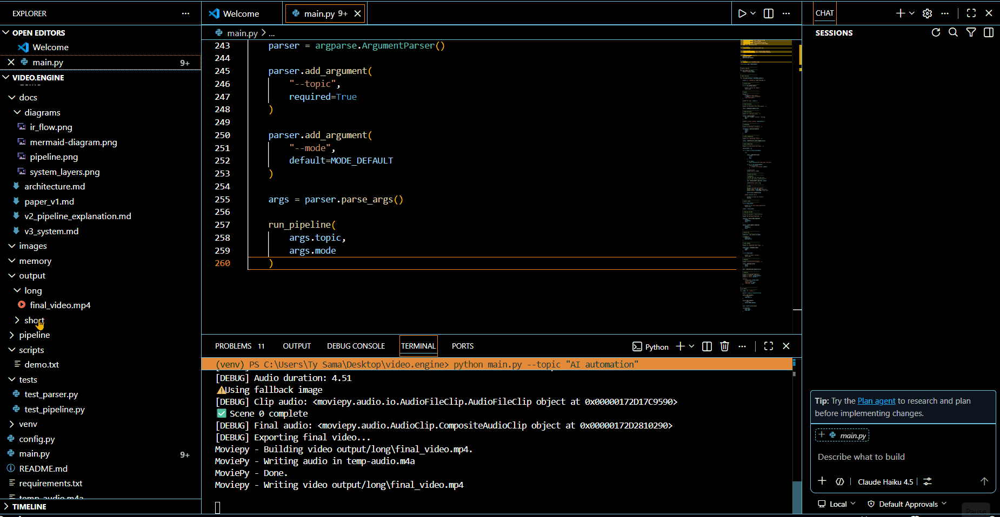
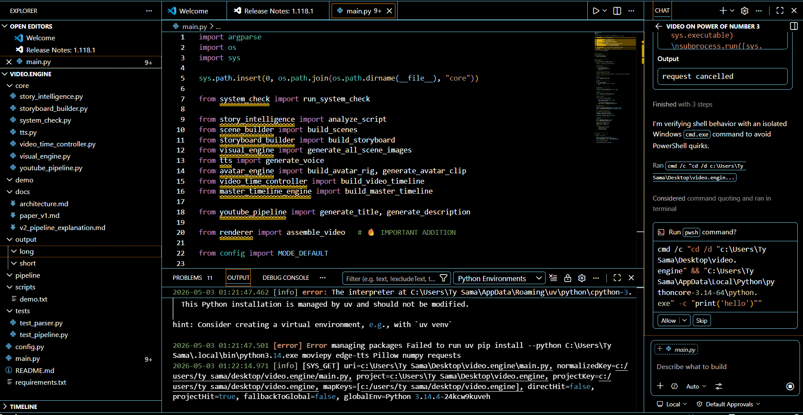

# AI Media Studio (V3)

> A modular AI video generation system that transforms scripts into fully rendered, multimodal videos through coordinated narrative planning, temporal synchronization, and AI-driven media synthesis.

---

## Overview

AI Media Studio (V3) is a systems-oriented generative media pipeline designed to automate long-form video creation from text inputs.

Instead of treating video generation as a single black-box model, the project decomposes the process into structured stages:

* narrative analysis
* scene planning
* intermediate representations (IRs)
* synchronized audio generation
* visual synthesis
* timeline orchestration
* cinematic rendering
* distribution preparation

The result is a reproducible, modular architecture capable of generating narrated, scene-aware videos with synchronized visuals, motion effects, and rendering logic.

This project was built to explore:

* multimodal AI orchestration
* structured generative systems
* temporal synchronization pipelines
* narrative-aware automation
* deterministic media generation
* scalable modular architectures

---

# Demo Previews

## Rendering Pipeline Demo

Shows the rendering pipeline constructing scenes, applying motion effects, syncing assets, and composing the final video timeline.



---

## Audio Processing Demo

Demonstrates narration generation, audio timing synchronization, and media asset coordination.



---

## Failure Recovery / Runtime Validation Demo

Highlights self-healing runtime checks, validation layers, and controlled failure handling.



---

# What the System Generates

Given a topic or script such as:

```text
"The future of AI in healthcare"
```

AI Media Studio automatically generates:

* structured narrative scenes
* AI voice narration
* AI-generated visuals and fallback B-roll
* motion effects and transitions
* speech-aligned timing
* beat-aware scene synchronization
* final rendered video output
* YouTube-ready metadata

### Example Output Flow

```text
Input Topic
    ↓
Narrative Analysis
    ↓
Scene Construction
    ↓
Storyboard Planning
    ↓
Audio + Visual Synthesis
    ↓
Timeline Coordination
    ↓
Video Rendering
    ↓
YouTube Distribution Assets
```

---

# Key Features

## Narrative-Aware Scene Generation

The system structures videos into semantic narrative units:

* hook
* introduction
* core segments
* transitions
* conclusion

Each scene carries metadata for:

* pacing
* energy
* timing
* visual intent
* narration alignment

---

## Intermediate Representation (IR) Architecture

V3 introduces structured IR layers that coordinate communication between pipeline stages.

### Scene IR

Represents:

* narration text
* scene duration
* visual requirements
* motion metadata
* audio bindings

### AIR (Audio IR)

Represents:

* speech timing
* beat alignment
* pacing signals
* synchronization data

Benefits:

* deterministic execution
* debuggable pipelines
* modular subsystem replacement
* traceable data flow

---

## Multimodal Synthesis

The system coordinates:

* text generation
* voice synthesis
* visual generation
* motion effects
* rendering timelines

### Integrated Components

* Edge-TTS narration
* AI image generation
* fallback B-roll system
* MoviePy rendering
* audio synchronization
* cinematic motion effects

---

## Temporal Coordination Engine

A unified timeline system synchronizes:

* narration duration
* beat timing
* visual cuts
* transitions
* motion pacing

This creates more natural scene flow and cinematic consistency.

---

## Hybrid Visual Pipeline

Visual generation combines:

* AI-generated imagery
* deterministic fallback assets
* storyboard-driven prompts
* motion-enhanced compositions

This hybrid strategy improves reliability while preserving generative flexibility.

---

## Self-Healing Runtime

The runtime validates:

* FFmpeg installation
* dependency availability
* asset paths
* generation outputs
* rendering prerequisites

Failures are isolated and handled gracefully to reduce pipeline crashes.

---

# System Architecture

## High-Level Pipeline

```text
Input Topic / Script
        ↓
Narrative Intelligence Layer
        ↓
Scene Builder
        ↓
Storyboard Engine
        ↓
Temporal Coordination Engine
        ↓
Audio + Visual Synthesis
        ↓
Rendering Engine
        ↓
Distribution Pipeline
```

---

## Core System Modules

| Module                 | Responsibility                               |
| ---------------------- | -------------------------------------------- |
| Narrative Intelligence | Extract pacing, tone, and structural signals |
| Scene Builder          | Convert scripts into Scene IR objects        |
| Storyboard Engine      | Define visual behavior and motion            |
| Timeline Engine        | Synchronize narration and scene timing       |
| TTS Engine             | Generate scene-aware narration               |
| Visual Engine          | Create AI visuals and fallback imagery       |
| Renderer               | Compose final video output                   |
| Distribution Layer     | Generate YouTube metadata assets             |

---

# Evolution of the System

## V1 — Deterministic Pipeline

### Characteristics

* sequential script → video workflow
* fixed scene structure
* static visuals
* reproducible rendering

### Limitation

Minimal semantic reasoning and adaptation.

---

## V2 — Adaptive Media Pipeline

### Improvements

* scene-aware visuals
* motion effects
* B-roll prioritization
* dynamic voice modulation
* retry handling and validation

### Limitation

Pipeline stages remained loosely coordinated.

---

## V3 — Structured Generative System

### Major Architectural Shift

V3 reframes video generation as a coordinated systems architecture rather than a linear pipeline.

### New Capabilities

* intermediate representations
* narrative intelligence layer
* semantic + execution timelines
* beat-aware synchronization
* modular orchestration
* self-healing runtime validation

---

# Repository Structure

```text
AI Media Studio/
│
├── core/                    # Core orchestration engines
├── assets/                  # Audio, images, avatars, B-roll
├── demo/                    # Rendered GIF demonstrations
├── docs/                    # Architecture + research documents
├── outputs/                 # Generated video exports
├── benchmarks/              # Pipeline performance testing
├── scripts/                 # Demo scripts / prompts
├── main.py                  # Entry point
└── requirements.txt         # Dependencies
```

---

# Research & Technical Documentation

The repository includes architecture notes and system design papers documenting the progression from V1 → V3.

## Included Documents

| Document                          | Description                                     |
| --------------------------------- | ----------------------------------------------- |
| `docs/paper_v1.md`                | Initial deterministic media pipeline concepts   |
| `docs/v2_pipeline_explanation.md` | Adaptive pipeline evolution and coordination    |
| `docs/v3_system.md`               | Structured generative system architecture       |
| `docs/architecture.md`            | Technical system overview and design principles |

These documents explain the engineering rationale behind:

* IR-driven architectures
* multimodal synchronization
* temporal orchestration
* deterministic generative systems
* modular AI pipelines

---

# Technologies Used

## Core Stack

* Python
* MoviePy
* FFmpeg
* Edge-TTS
* PIL / Image Processing
* Audio Processing Utilities

## Architectural Concepts

* Intermediate Representations (IRs)
* Multimodal AI Coordination
* Temporal Synchronization
* Narrative Signal Extraction
* Structured Media Pipelines
* Deterministic System Design

---

# Quick Start

## Clone the Repository

```bash
git clone https://github.com/Tybent18/ai-media-studio
cd ai-media-studio
```

---

## Install Dependencies

```bash
pip install -r requirements.txt
```

---

## Run the Pipeline

```bash
python main.py --topic "The future of AI"
```

---

## Output

```text
outputs/video.mp4
```

---

# Design Principles

## Deterministic Execution

Identical inputs produce reproducible outputs.

---

## Modular Architecture

Subsystems are independently replaceable.

---

## Explicit Data Flow

No hidden state between stages.

---

## Failure Isolation

Errors are contained at the module level.

---

## Structured Orchestration

The system behaves similarly to a media compiler with coordinated generation stages.

---

# Current Limitations

* image-based generation only (no native video diffusion)
* limited distributed rendering support
* lightweight avatar integration
* mostly rule-based narrative reasoning
* no real-time editing interface
* no learned optimization models yet

---

# Future Work

Planned research and engineering directions:

* diffusion-native video generation
* reinforcement learning for pacing optimization
* learned narrative planning systems
* distributed rendering infrastructure
* advanced avatar animation systems
* real-time editing and orchestration UI
* adaptive scene optimization

---

# Why This Project Matters

Most generative media systems focus solely on output quality.

AI Media Studio instead focuses on:

* orchestration
* synchronization
* modularity
* traceability
* controllable generation
* systems-level coordination

The project explores how AI media generation can be engineered as a structured computational system rather than a monolithic model.

---

# Summary

AI Media Studio (V3) is a research-oriented generative media system that combines:

* narrative intelligence
* multimodal synthesis
* temporal orchestration
* modular AI pipelines
* deterministic rendering systems

into a coordinated architecture capable of transforming text into fully rendered video content.

It serves as both:

* a functional AI media generation platform
* a systems-design exploration into structured generative architectures

---

# Author

Developed as an independent systems engineering and AI media architecture project focused on multimodal orchestration, deterministic generation pipelines, and scalable AI-assisted content creation.
