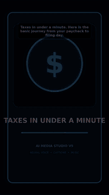

# AI Media Studio V5

**A free personal AI video maker for narrated 1080p YouTube videos and vertical social video.**

AI Media Studio is a local-first orchestration workspace for YouTube videos and Shorts. It uses an FFmpeg pipeline that produces real MP4 files without requiring paid AI services. Image, voice, avatar, and music systems remain modular, so local fallbacks work while optional integrations can be added without rewriting the renderer.

V5 completes the free production path: neural Piper and Edge TTS narration, user-owned image/video B-roll,
burned captions, Ken Burns motion, fades, imported or original procedural music, independent voice/music gain,
loudness normalization, and full-HD exports. Long-form renders at 1920×1080; vertical renders at 1080×1920.

The desktop workspace now includes a script editor, editable scene list, per-scene media and duration controls,
live render-frame monitoring, an embedded visual MP4 preview, and four selectable interface styles. Finished videos
can also open in the operating system player for synchronized audio playback.

## Make a narrated YouTube video

```bash
pip install -r requirements.txt
python main.py --topic "My video" --script "Hook: Start strong.\nPoint: Explain the idea.\nOutro: End clearly." \
  --voice-volume 1.0 --music-volume 0.24
```

Add a folder of your own images and clips:

```bash
python main.py --topic "My video" --script "Hook: Start strong.\nPoint: Show the evidence." --media-dir assets/my-project
```

You can pin a specific asset to a scene with `[media=path/to/file.mp4]`. Use `--music path/to/song.mp3` for music you own, `--voice en-US-AriaNeural` to change narrator, or `--silent` for an offline preview. The GUI exposes narration, B-roll, and music selection with `python main.py --gui`.

## Natural offline narration with Piper

```bash
pip install '.[voice]'
python main.py --topic "My video" --piper-model voices/en_US-lessac-medium.onnx
```

Piper voice models are separate downloads. Select the matching `.onnx` model in the GUI or pass it with `--piper-model`. The Studio never uploads narration text when Piper is selected.

## YouTube Audio Library imports and credits

Download the track yourself from YouTube Studio's Audio Library, then import the audio file and the track metadata:

```bash
python main.py --topic "My video" \
  --youtube-audio music/track.mp3 \
  --music-title "Track Name" \
  --music-artist "Artist Name" \
  --music-attribution "Exact attribution text copied from YouTube Audio Library"
```

The Studio writes the exact credit into `video-description.txt`, records it in `project.json`, and adds a short end-card credit. Some YouTube Audio Library tracks do not require attribution; Creative Commons tracks do. Always copy the exact attribution supplied by YouTube instead of inventing a generic ownership disclaimer.

> Current boundary: V5 renders and packages videos locally. Direct YouTube upload and analytics remain intentionally
> deferred. Edge TTS needs an internet connection; Piper provides the recommended neural offline narration path.

## Production demos

### V5 rendered explainer proof

This is a real vertical educational video rendered by the V5 pipeline with Piper neural narration, captions, motion,
and the audible procedural music mix—not a design mockup. It uses a simple tax explainer so the production features
are easy to understand at a glance.

[Download the complete MP4 demo with voice and music](demo/v5/taxes-in-under-a-minute.mp4)

[](demo/v5/taxes-in-under-a-minute.mp4)

### Earlier pipeline walkthroughs

#### Long-form workflow


#### Shorts workflow


Regenerate the older deterministic interface demonstrations with:

```bash
python tools/generate_demos.py
```

Regenerate the narrated tax video after installing Piper and downloading `en_US-lessac-medium` with:

```bash
python tools/generate_tax_demo.py
```

## What changed in V5

| Capability | V4 | V5 |
| --- | --- | --- |
| Output | 1280×720 / 720×1280 | 1920×1080 / 1080×1920 at 30 fps |
| Narration | Timed silence fallback | Piper neural, Edge neural, Flite, or silent preview |
| Music | Quiet procedural bed | Fuller original score, local imports, and Audio Library credits |
| Mixing | Fixed mix | Independent voice and music levels plus loudness normalization |
| Editing | Script-only workspace | Editable scenes, duration, text, kind, and scene media |
| Preview | Output path only | Live render frames and embedded finished-video visuals |
| Interface | Fixed theme | Four selectable application styles and friendly provider names |
| Media | Generated cards | User-owned images and looping video B-roll |

## Desktop production workspace

```bash
python -m venv .venv
source .venv/bin/activate        # Windows: .venv\Scripts\activate
pip install -e ".[dev]"
python main.py --gui
```

The workspace provides:

- long 16:9 and short 9:16 selection;
- editable tagged scenes (`Hook:`, `Intro:`, `Point:`, `Outro:`);
- a scene editor for text, type, duration, and media replacement;
- image, voice, avatar, and music provider selectors;
- Obsidian Neon, Violet Cinema, Ember Studio, and Arctic Light interface styles;
- separate voice and music volume controls;
- live render-frame monitoring and embedded visual playback;
- full playback with audio through the operating system player;
- progress, safe cancellation, output opening, and project-manifest saving;
- provider-neutral project data that other applications can consume.

## Command-line rendering

FFmpeg must be installed and available on `PATH`.

```bash
python main.py --topic "Creative AI Explained" --mode long
python main.py --topic "Three Debugging Habits" --mode short --theme violet
```

Each run creates a versioned output directory:

```text
output/<long|short>/<run-id>/
├── <project-title>.mp4
├── project.json
└── provider-catalog.json
```

The manifest records format, providers, theme, duration, output path, and scene-level evidence.

## Provider architecture

| Media | Working local provider | Adapter/import contracts |
| --- | --- | --- |
| Images | Deterministic storyboard cards | OpenAI Image API, Google Imagen, Stability AI |
| Voice | Piper neural, Edge TTS, Flite, silent preview | ElevenLabs TTS and consent-gated cloning |
| Avatar | Local illustrated VTuber host | Live2D import, HeyGen adapter |
| Music | Original procedural score and local files | YouTube Audio Library, Suno, and Udio imports |

Credentials belong in environment variables, never project files. Voice cloning must require proof of authorization; the system does not provide an impersonation shortcut.

Official references used by the provider catalog:

- [OpenAI image generation](https://platform.openai.com/docs/guides/image-generation)
- [Google Imagen on Vertex AI](https://cloud.google.com/vertex-ai/generative-ai/docs/image/overview)
- [Stability AI platform](https://platform.stability.ai/docs)
- [ElevenLabs API](https://elevenlabs.io/docs/eleven-api/quickstart)
- [ElevenLabs voice-cloning concepts](https://elevenlabs.io/docs/eleven-api/concepts/voice-cloning)
- [Live2D](https://www.live2d.com/en/)
- [HeyGen API](https://docs.heygen.com/)

## Architecture

```text
Editable project
    ↓
Scene planning
    ↓
Image provider ─ Voice provider ─ Avatar provider ─ Music provider
    ↓
FFmpeg scene rendering
    ↓
Long 16:9 / Short 9:16 composition
    ↓
MP4 + project manifest + provider manifest
```

Key modules:

| Module | Responsibility |
| --- | --- |
| `media_studio/models.py` | Typed project, scene, and format contracts |
| `media_studio/providers.py` | Provider catalog and reliable local media generation |
| `media_studio/renderer.py` | Cancellable FFmpeg rendering and audio mix |
| `media_studio/pipeline.py` | Stage orchestration, manifests, and cleanup |
| `media_studio/gui.py` | Customizable desktop editor and progress surface |
| `tools/generate_demos.py` | Deterministic README demonstrations |

The earlier `core/` implementation remains temporarily available for architectural comparison and migration. `main.py`
routes new work through V5.

## Verification

```bash
pytest -q
```

The suite renders actual MP4 files and probes them with FFprobe. It validates both canvas formats, output audio/video streams, project manifests, provider contracts, scene limits, themes, and cancellation behavior.

## Current limitations

- Embedded playback is visual; use **Open with sound** for synchronized audio playback in the system player.
- The local avatar is a static VTuber-style overlay, not full Live2D rigging or lip sync.
- Remote provider contracts are cataloged but not invoked without explicit adapters and credentials.
- Scene edits require a new render; this is not yet a frame-accurate multitrack nonlinear editor.
- Direct publishing, channel authentication, and analytics are deferred to a later phase.

## Next engineering milestones

1. Implement authenticated provider adapters behind the existing contracts.
2. Add consent records and sample-quality checks for voice cloning.
3. Add draggable scene ordering and a frame-accurate timeline with trim handles.
4. Add Live2D/VRM avatar import and audio-driven mouth cues.
5. Add resumable render checkpoints and hardware-acceleration profiles.
6. Add opt-in YouTube upload only after OAuth, review, and publish-confirmation controls exist.

## License

[MIT](LICENSE)

## V6 experimental layered explainer renderer

The `Animated infographic explainer` provider now uses a layered scene director rather than a flattened storyboard card. Each scene is planned as independently animated text, presenter, signs, equations, and number-line elements. Reusable presenter/sign assets are cached under `assets/v6/`.

Current V6 experiment:
- persistent reusable asset library
- script-aware equation and number-boundary scene planning
- independently timed layer entrances
- pop, slam, slide, wipe, and presenter reaction animations
- Edge TTS narration through the existing production pipeline
- FFmpeg final composition, captions, music, and audio validation

The next visual tier is pluggable generated illustration assets while retaining the same scene-plan/timeline architecture.


## V6 — Generative visual production

V6 adds production-quality AI visual modes intended to move beyond deterministic storyboard cards.

### AI Storyboard — High Quality
Generates a polished illustrated composition for each scene, caches it under `assets/v6/generated/storyboards/`, and sends it through the existing narration, motion, caption, music, and FFmpeg pipeline.

Set an OpenAI API key before launching:

Windows PowerShell (current terminal):
```powershell
$env:OPENAI_API_KEY="your-key-here"
.\.venv\Scripts\python.exe main.py --gui
```

To persist it for future terminals:
```powershell
setx OPENAI_API_KEY "your-key-here"
```
Then close and reopen VS Code before launching the app.

Optional model override:
```powershell
$env:AI_MEDIA_IMAGE_MODEL="gpt-image-2"
```

### AI Layered Assets — Experimental
This option currently uses the high-quality generated storyboard as its visual baseline while the V6 compositor is extended to request reusable transparent presenter poses, props, backgrounds, and foreground elements separately. The architecture is intentionally provider-based so generated assets can be cached and animated independently.

### Quality philosophy
Generated artwork avoids long embedded text. Exact equations, captions, labels, and typography should remain deterministic renderer layers. This combines generative illustration quality with reliable educational notation.
