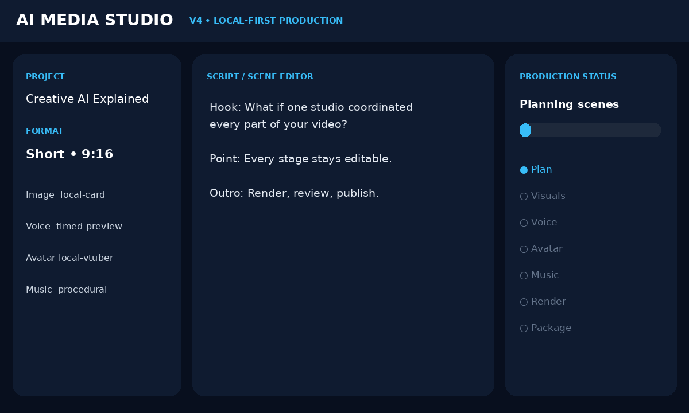

# AI Media Studio V4

**Turn an editable script into a real long-form or vertical video through a visible, cancellable production pipeline.**

AI Media Studio is a local-first orchestration workspace for YouTube videos and Shorts. V4 replaces the non-rendering legacy path with an FFmpeg pipeline that produces real MP4 files without requiring paid AI services. Image, voice, avatar, and music systems are provider contracts, so local fallbacks remain available while cloud integrations can be added without rewriting the renderer.

> Current boundary: V4 renders and packages videos locally. Direct YouTube upload and analytics are intentionally deferred. Remote provider entries describe adapter contracts; they are not fake integrations.

## Production demos

### Long-form workflow


### Shorts workflow



Regenerate both deterministic demonstrations with:

```bash
python tools/generate_demos.py
```

## What changed

| Capability | Previous V3 baseline | V4 |
| --- | --- | --- |
| Documented installation | Missing `requests`; startup fails | Declared dependencies and package metadata |
| Movie rendering | MoviePy 1.x imports fail with current MoviePy | Direct FFmpeg renderer |
| Tests | Collection fails before running | Real long/short render tests |
| Output formats | Mode label without verified canvas | 1280×720 long and 720×1280 short |
| Offline operation | Visual fallback only | Images, timed audio, avatar, and music |
| Progress | Console messages | Seven visible production stages |
| Cancellation | Not implemented | Active FFmpeg process termination and cleanup |
| Editing | Script generated inside pipeline | Editable script/scene workspace |
| Customization | Fixed presentation | Four interface/render themes and provider choices |
| Avatar | Placeholder text written into an `.mp4` | Real transparent VTuber-style overlay |
| Music | Analysis hooks but no reliable source | Original deterministic procedural soundtrack |

## Desktop production workspace

```bash
python -m venv .venv
source .venv/bin/activate        # Windows: .venv\Scripts\activate
pip install -e ".[dev]"
python main.py --gui
```

The workspace provides:

- long 16:9 and short 9:16 selection;
- editable tagged scenes (`Hook:`, `Intro:`, `Point:`, `Outro:`);
- image, voice, avatar, and music provider selectors;
- Midnight, Ember, Forest, and Violet themes;
- progress, safe cancellation, output opening, and project-manifest saving;
- provider-neutral project data that other applications can consume.

## Command-line rendering

FFmpeg must be installed and available on `PATH`.

```bash
python main.py --topic "Creative AI Explained" --mode long
python main.py --topic "Three Debugging Habits" --mode short --theme violet
```

Each run creates a versioned output directory:

```text
output/<long|short>/<run-id>/
├── <project-title>.mp4
├── project.json
└── provider-catalog.json
```

The manifest records format, providers, theme, duration, output path, and scene-level evidence.

## Provider architecture

| Media | Working local provider | Adapter/import contracts |
| --- | --- | --- |
| Images | Deterministic storyboard cards | OpenAI Image API, Google Imagen, Stability AI |
| Voice | Timed preview audio | Edge TTS, ElevenLabs TTS and consent-gated cloning |
| Avatar | Local illustrated VTuber host | Live2D import, HeyGen adapter |
| Music | Deterministic original score | User-authorized Suno and Udio exports |

Credentials belong in environment variables, never project files. Voice cloning must require proof of authorization; the system does not provide an impersonation shortcut.

Official references used by the provider catalog:

- [OpenAI image generation](https://platform.openai.com/docs/guides/image-generation)
- [Google Imagen on Vertex AI](https://cloud.google.com/vertex-ai/generative-ai/docs/image/overview)
- [Stability AI platform](https://platform.stability.ai/docs)
- [ElevenLabs API](https://elevenlabs.io/docs/eleven-api/quickstart)
- [ElevenLabs voice-cloning concepts](https://elevenlabs.io/docs/eleven-api/concepts/voice-cloning)
- [Live2D](https://www.live2d.com/en/)
- [HeyGen API](https://docs.heygen.com/)

## Architecture

```text
Editable project
    ↓
Scene planning
    ↓
Image provider ─ Voice provider ─ Avatar provider ─ Music provider
    ↓
FFmpeg scene rendering
    ↓
Long 16:9 / Short 9:16 composition
    ↓
MP4 + project manifest + provider manifest
```

Key modules:

| Module | Responsibility |
| --- | --- |
| `media_studio/models.py` | Typed project, scene, and format contracts |
| `media_studio/providers.py` | Provider catalog and reliable local media generation |
| `media_studio/renderer.py` | Cancellable FFmpeg rendering and audio mix |
| `media_studio/pipeline.py` | Stage orchestration, manifests, and cleanup |
| `media_studio/gui.py` | Customizable desktop editor and progress surface |
| `tools/generate_demos.py` | Deterministic README demonstrations |

The earlier `core/` implementation remains temporarily available for architectural comparison and migration. `main.py` routes new work through V4.

## Verification

```bash
pytest -q
```

The suite renders actual MP4 files and probes them with FFprobe. It validates both canvas formats, output audio/video streams, project manifests, provider contracts, scene limits, themes, and cancellation behavior.

## Current limitations

- Local preview audio is timed rather than spoken narration; select or implement a network TTS adapter for speech.
- The local avatar is a static VTuber-style overlay, not full Live2D rigging or lip sync.
- Remote provider contracts are cataloged but not invoked without explicit adapters and credentials.
- The scene editor is script-oriented rather than a multitrack nonlinear editor.
- Direct publishing, channel authentication, and analytics are deferred to a later phase.

## Next engineering milestones

1. Implement authenticated provider adapters behind the existing contracts.
2. Add consent records and sample-quality checks for voice cloning.
3. Add draggable scene ordering, per-scene duration controls, and media replacement.
4. Add Live2D/VRM avatar import and audio-driven mouth cues.
5. Add resumable render checkpoints and hardware-acceleration profiles.
6. Add opt-in YouTube upload only after OAuth, review, and publish-confirmation controls exist.

## License

[MIT](LICENSE)
